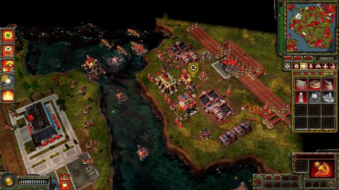
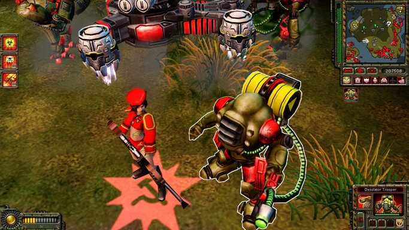
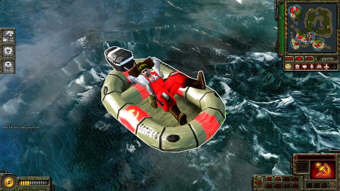

These bash scripts unlock camera zoom limits in Command & Conquer: Red Alert 3 and Uprising.
Run it in background while the game is running.  

Dependencies:  
gdb  
[scanmem](https://github.com/scanmem/scanmem)  

[breakpoints.nfo](breakpoints.nfo) contains instructions addresses I was able to find, scripts use those to find the lock address.  
[reference.nfo](reference.nfo) contains info post that helped finding the lock variable. All say infinite thanks to H0Ju, Rose and WSGF community for this and their cool program!  

tags: ra3 c&c red alert 3 zoom mod unlock zoom zoom fix patch zoom mod camera uprising
